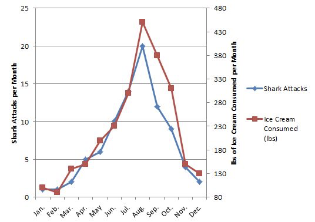

# Introduction To Experiments (Some Philosophy) {#intro}

Experiments help us answer questions, but there are also non-experimental techniques. What is so special about experiments? 

1. Experiments allow us to set up a direct comparison between the treatments of interest.
2. We can design experiments to minimize any bias in the comparison.
3. We can design experiments so that the error in the comparison is small.
4. Most important, we are in control of experiments, and having that control
allows us to make stronger inferences about the nature of differences
that we see in the experiment. Specifically, we may make inferences
about causation.

This last point distinguishes an experiment from an observational study. In an observational study we merely observe which units are in which treatment groups; we don’t get to control that assignment.  This underpins the classic issue with assigning _causation to correlation_ - in the following two examples, there is a strong association between the variables, but there has been no control/manipulation.

```{r, echo = FALSE}

knitr::include_graphics("images/Autism_Organic.png")
```

Mosteller and Tukey (1977) list three concepts associated with causation and state that two or three are needed to support a causal relationship:

- Consistency – make a change and the response is in the same direction or the amount of response is _consistent_ across populations
- Responsiveness – make a change and the response changes according to theory
- Mechanism – make a change and we can monitor/identify a mechanism leading from cause to effect

Let's look at a classic example.  Smoking and lung cancer – from 1922 to 1947 annual deaths for lung cancer went from 612 to 9287 (Observation).This was thought in the 1950s to be either an effect of smoking tobacco or atmospheric pollution (Hypothesis). Numerous studies showed that lung cancer was more prevalent in smokers (Observation: consistency). Chemical analyses of tobacco showed it contained carcinogens (Association: mechanism). Public health programs resulted in a reduction in smoking and lung cancer rates decreased (Intervention: responsiveness). 

Note the initial study was an observational study and in this case it was not ethical to do the experiment per se!

## How to think about experiments: Components of an Experiment

An experiment has treatments, experimental units, responses, and a method to assign treatments to units.  These specify the experimental design.

Not all experimental designs are created equal. A good experimental design must adhere to the 3Rs. It should reveal consistency, responsiveness and mechanism.  The way this happens is by avoiding systematic error in measuring things, and allow estimation of error in measurments with precision.  In short, a good experimental design must

- Avoid systematic error
- Allow estimation of error
- Be precise
- Have broad validity.

Lets walk through some definitions.

If our experiment has _systematic error_, then our comparisons will be biased, no matter how precise our measurements are or how many experimental units we use. **Randomisation** is our tool to combat _systematic error_.

Even without _systematic error_, there will be random error in the responses - this is what we call variation in what we are measuring or more formally variance.  Such variation in responses invariably leads to random error in the treatment comparisons.  When we compared two means in the t-test, we had to deal with the variation in both groups! 

Experiments are precise when this random error in the treatment comparisons is small. Precision depends on the size of the random errors in the responses, the number of units used (**replication**), and the experimental design used.

Experiments must be designed so that we have an estimate of the size of random error. This permits statistical inference: for example, confidence intervals or tests of significance based on t- or F-statistics. 

We cannot do inference without an estimate of this variation. We would like our conclusions to be valid for a wide population, so we need to randomise our subjects or objects we are measuring - for example, we may need to be aware of both sexes and of young and old individuals.  But there are always compromises - for example, broadening the scope of validity by using a variety of experimental units may decrease the precision of the responses.

### How do we increase precision and reduce bias?

There are several key concepts

#### Blinding
_Blinding_ occurs when the evaluators of a response do not know which treatment was given to which unit. Blinding helps prevent bias in the evaluation, even unconscious bias from well-intentioned evaluators. Double blinding occurs when both the evaluators of the response and the (human subject) experimental units do not know the assignment of treatments to units. Blinding the subjects can also prevent bias, because subject responses can change when subjects have expectations for certain treatments.

#### Placebos
_Placebo_ is a null treatment that is used when the _act_ of applying a treatment— any treatment — has an effect. Placebos are often used with human subjects, because people often respond to the process of receiving any treatment: for example,
reduction in headache pain when given a sugar pill. Blinding is important when placebos are used with human subjects. Placebos are also useful for nonhuman subjects. The apparatus for spraying a field with a pesticide may compact the soil. Thus we drive the apparatus over the field, without actually spraying, as a placebo treatment.

#### Confounders
_Confounding_ occurs when the effect of one factor or treatment cannot be distinguished from that of another factor or treatment. The two factors or treatments are said to be confounded. Except in very special circumstances, confounding should be avoided. Consider the following example.  We plant corn variety A in Yorkshire and corn variety B in Lancashire. In this experiment, we cannot distinguish location effects (Yorkshire vs. Lancashire) from variety effects (cornA vs. cornB) — the variety factor and the location factor are confounded.

This is despite the fact that we know that Yorkshire will be better.... (that's a joke)

## Experimental vs Measurement units

A common source of difficulty in designing experiments is the distinction between experimental units and measurement units.  We need to know the experimental units, as this is the key value used to generate our inference. 

Consider an educational study, with six classrooms of 25 pupils. Each classroom of students is then assigned, at random, to one of two different reading programmes.  

At the end of a 6 week term, all the students are evaluated via a common reading exam.

So, are there six experimental units (the classrooms) or 150 (25*6; the students)?  We measured the reading ability of the students... but they were in classroom sets of 25....

####  Identifying the experimental unit - an example of **pseudo-replication**

To identify the experimental units the key question is: What did we randomly allocate treatments to?

If we randomly allocated reading programmes to students, then students would be the experimental units. But we don’t so the classroom is the experimental unit – it is the classroom to which we randomly allocated treatments.  The classroom is the experimental unit.   But we don’t measure how a classroom reads; we measure how students read. Thus students are the measurement units for this experiment.

Confusing these two things can lead to **pseudo-replication**. Treating measurement units as experimental usually leads to overoptimistic analysis — we will reject null hypotheses more often than we should, and our confidence intervals will be too narrow. The usual way around this is to determine a single response for each experimental unit. 

#### This really matters.

Consider an experiment with 2 growth chambers each containing 100 plants. One of the chambers received enhanced C02. One night after collecting data you leave the door open on the C02 chamber and the temperature drops and so the plants grow more slowly. When you come to analyze the data you get a highly significant effect but C02 results in reduced plant growth not what you expect. 

This is entirely plausible.

Consider a second experiment where you really do have 200 growth chambers and randomly allocate plants to each. If you forget to close one door it really has no effect as just one plant is affected.

To get the same effect as in the first experiment you would have to accidentally leave the doors open on all the C02 chambers. This is very unlikely indeed!!!

There are 9x1058 ways selecting 100 chambers from 200 chambers so the chance of accidentally picking all the C02 chambers is 1/ 9x10580 (stars in universe 7 x 1022).

Proper **randomization** and **replication** is very different from **pseudo-replication**.

### Take Home Message: Randomization properly with Replication protects against Confounding

>An experiment is randomized if the method for assigning treatments to units involves a known, well-understood probabilistic scheme. The probabilistic scheme is called a randomization.

> In general, more experimental units with fewer measurement units per experimental unit works better. However, smaller experimental units are inclined to have greater edge effect problems than are larger units, so this recommendation needs to be moderated by consideration of the actual units.

No matter which features of the population of experimental units are associated with our response, our randomizations put approximately _half the individuals with these features_ into _each treatment group_.

Recall our example above of considering sex and age of subjects and imagine a treatment with two levels (hot and cold).  Done well, proper randomisation will put approximately half the males, half the females, half the older, half the youger etc into each of the treatment levels.

The beauty of randomization is that it helps prevent confounding, even for factors that we do not know are important.

### A non-randomized experiment – **haphazard** is NOT randomized

A company is evaluating two different word processing packages for use by its clerical staff. Part of the evaluation is how quickly a test document can be entered correctly using the two programs. We have 20 test secretaries, and each secretary will enter the document twice, using each program once.

Suppose that all secretaries did the evaluation in the order A first and B second. Does the second program have an advantage because the secretary will be familiar with the document and thus enter it faster? Or maybe the second program will be at a disadvantage because the secretary will be tired and thus slower.

Randomization generally costs little in time and trouble, but it can save us from `disaster`.

Anything that might affect your responses should be randomized! For example

- If the experimental units are not used simultaneously, you can randomize the order in which they are used.
- If the experimental units are not used at the same location, you can randomize the locations at which they are used.
- If you use more than one measuring instrument for determining response, you can randomize which units are measured on which instruments.

## Mini-Quiz
>A PhD student want to determine the effects of protein on beetle fecundity so they design an experiment with a control and protein enhanced diet. To assign beetles to each of the treatments they pour a culture onto the table and catch the first 30 beetles that run to the edge of the table, these receive the protein enhanced diet. The next 30 beetles go in the control. **Is this randomized?** 

## Replication: How many? 

No simple rules... it depends... on....

- Resources available
- Variability of experimental units
- Treatment structure – more later
- Size of effect that’s important
- Relative importance of different comparisons

There is, however, a set of tools that can help with estimating sample sizes.  It's called power analysis and requires that you have some a priori estimate of the expected variation in your response variable.


