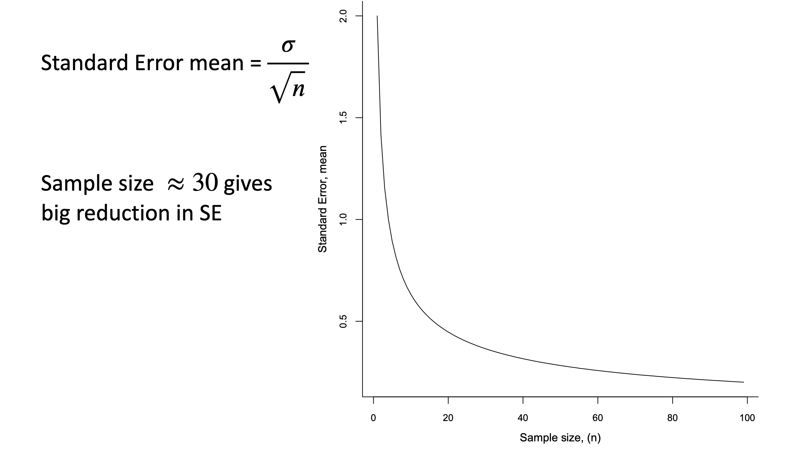
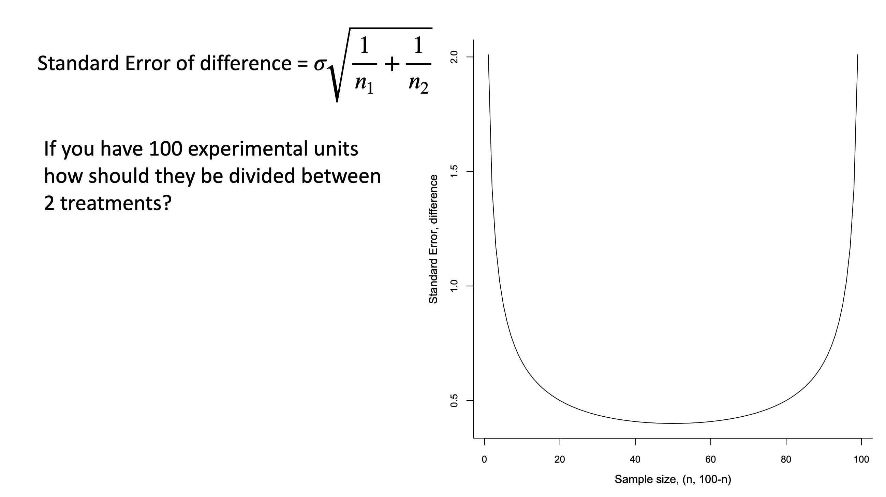

# Standard Errors, Precision and Sampling

## Standard Errors and precision

One of the most important statistical metrics to wrap your heads around is the standard error of the mean.

We introduced this in the first semester and there is a good discussion of it in the APS 240 reading.  You should re-read this section:

https://dzchilds.github.io/stats-for-bio/sampling-error.html

The take home message is that the standard error is a quantitative measure of sampling error variation.  It is also very sensitive to the sample size, because the equation is `sd(variable)/sqrt(sample_size)`.  As the sample size increases, the standard error, an estimate of the sampling error, goes down.

```{r, echo = FALSE}

```

### SE of a Difference and Balance.

Interestingly, we often are estimating the standard error of a difference.  Remember the t-test?  The test statstic is all about the difference between the means.  We need a precise estimate of that difference to assess whether the null hypothesis (the differene = 0) can be rejected or not.

The standard error of a difference behaves differently, however.

```{r, echo = FALSE}

```

What this suggests is that we allocate our sample sizes in a balanced manner - 50% to each group/treatment level.  In general balanced designs are good – equal numbers of replicates per treatment.

### However sometimes unbalanced designs are better.

Say we have g treatments one of which is a control, say treatment 1, and we want to compare each of the other treatments with the control, so treatment 2 vs Control, treatment 3 vs Control, treatment 4 vs Control, etc. Then as we compare everything with the control we want more replicates of the control. The best allocation is $n_{c} = n_{t}\sqrt{(g-1)}$
where $n_{t}$ is the number of replicates in the non-control treatment.

## The CRD: Completely Randomised Design

Against this backdrop of understanding **randomisation** and **replication**, the most basic design is the Completely Randomized Design:

We have g treatment levels to compare (e.g. Hot, Warm, Cold) and N units to use in our experiment. For a completely randomized design:

1. Select sample sizes $n_{1}, n_{2}, . . . , n_{g} = N$. Often we set the n’s to be equal so we have a  balanced design.
2. Choose $n_{1}$ units at random to receive treatment 1, $n_{2}$ units at random from the N − n1 remaining to receive treatment 2, and so on.


