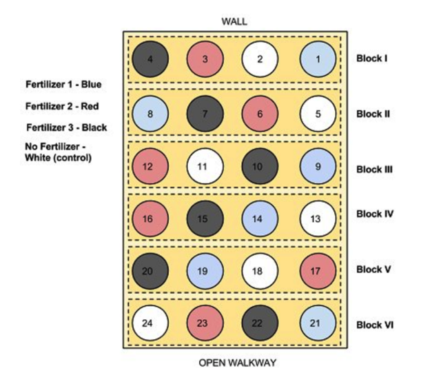

```{r, echo = FALSE}
library(tidyverse)
library(agricolae)
library(visreg)
library(gmodels)
```

# Randomized Complete Block design (RCB)

Blocking allows us to reduce the experimental error.

A block is a group of experimental units that are homogeneous in some sense – in the same place, or measured at the same time, or by the same person.  So when constructing blocks we try and select experimental units that are homogeneous within blocks but units in different blocks may be dissimilar.

Why block? When we use a completely randomised design, the location or timing of our treatment 'plots' (patches, incubators, locations in a 96 well plate) can generate heterogeneity in experimental error (variation).  As the variance of the Experimental Error increases, confidence intervals get wider and the power of our analysis decreases - it's harder to detect effects of our treatments against the background noise.  Ideally we would like to use experimental units that are homogeneous so the experimental error will be small.  Blocking does this.

The simplest blocked design is the **Randomized Complete Block design (RCB)**

We have one complete set of treatments in each block. Say you have g Treatments and r Blocks then the total number of experimental units is?

In the first block, we randomly assign the g treatments to the n units; we do an independent randomization, assigning treatments to units in each of the other blocks. This is the RCB design.

For example, consider the following matrix: the rows are the blocks, the letters the different treatments.  In each block, each treatment is represented, but it is in a different location in the block (randomisation of the g treatments in the n units).  The blocks are in a sequence - left to right - this could be different days, different locations or different positions on a hillside, for example representing an elevation or soil moisture gradient.  

The Blocks are designed to 'capture' that underlying source of variability and allow us to detect among treatment differences more effectively.

```{r echo=FALSE}
# this will make sure student letters are the same as these
set.seed(123)

matrix(replicate(5, sample(LETTERS[1:5])), byrow = FALSE, ncol = 5)
```

Here is another picture of a block design that moves from just letters to something more literal.

```{r, echo = FALSE}

```

The blocks are arranged along a gradient, say along the side of a hill, so represent low and high elevation and associated soil moisture. The blocks capture this background variation. THEN, each treatment level (1-4) is allocated a random position in each block.  In the end, each treatment level is replicated across blocks (n = 6!). From: https://www.researchgate.net/publication/322369242_Randomized_Block_Design_probiotic_example/figures?lo=1

It is important to note that blocks exist at the time of the randomization of treatments to units. We cannot impose blocking structure on a completely randomized design after the fact; either the randomization was blocked or it was not.

We use an RCB to increase the power and precision of an experiment by decreasing the error variance. This decrease in error variance is achieved by finding groups of units that are homogeneous (blocks) and, in effect, repeating the experiment independently in the different blocks. The RCB is an effective design when there is a single source of extraneous variation in the responses that we can identify ahead of time and use to partition the units into blocks.

In short ALWAYS block your experiment, if you can.

You can have spatial blocks, or temporal blocks where you repeat the experiment at different times, or block by batch.

In general, any source of variation that you think may influence the response and which can be identified prior to the experiment is a candidate for blocking. 

## An example of the RCBD

Lets modify our previous example to including blocking.  Start another section with some ## and call it Blocking Example.

Of course, if you want to start another script, you can, but make sure you include all of the library()'s again!

```{r}
#Randomised Complete Block Design

# ensure allocation is the same
set.seed(123)

# define the treatments
treat <- c("Control","Herb1","Herb2","Placebo")

# define the number of blocks
Nblocks <- 5

# consider this
Total.units <- Nblocks * length(treat)

# build the design
design <- design.rcbd(treat, Nblocks, serie = 0)$book

# look at it
design

```

This is like the matrix above, but in tidy format!  Excellent.  This is how a block design looks in tidy-land.

Now, lets generate some data again.

```{r}
# set seed again ... 
set.seed(123)

# define the error - note how we use the variable Total.units to get the number of observations
error <- rnorm(Total.units, mean = 0, sd = 1) # is this more or less variation than before?

# generate the observations
# note that we are now generating larger differences (10 and 9) among treatments
# e.g. Herb1 is 10 units larger than the control.
design$obs <- 20 + 
  (design$treat=="Herb1") * 10 + 
  (design$treat == "Herb2") * 9 + 
  (design$treat == "Placebo") * 1 + 
  # note that we are defining variation among blocks here
  # block 1 is on average 10 units higher.... and block 5 is...
  (design$block==1) * 10 - (design$block==5) * 10 + 
  error

head(design, 10)
```

## Analysing the CRBD

I'll leave it to you now to generate the following picture of the means ± standard errors.  

This requires thinking hard about the use of dplyr tools (`group_by()` and `summarise()`) and ggplot (adding more than one layer from two different sources of data - the summary data and the raw data).  

Can you see our generation of block 1 and 5's variation?

```{r, echo = FALSE}
# check the data
glimpse(design)

# summarise to get means and ses
sumDat <- design %>% 
  group_by(treat) %>% 
  summarise(
    meanYield = mean(obs),
    seYield = sd(obs)/sqrt(n())
  )

# plot the raw data and the mean±se
# start with the mean±se and then add the raw data
ggplot(sumDat, aes(x = treat, y = meanYield))+
  geom_point(size = 3)+
  geom_errorbar(data = sumDat, aes(ymin = meanYield - seYield, ymax = meanYield+seYield),
                width = 0.1)+
  geom_point(data = design, aes(x = treat, y = obs, colour = block), alpha = 0.5, size = 5)

```

### Building the model

In order to understand what's going on with blocking, and it's importance, lets build the naive model that ignores block - treating this as a CRB - and the correct model, letting block absorb some of the variation.

```{r}
# models
naive_model <- lm(obs ~ treat, design)
block_model <- lm(obs ~ block + treat, design) # note the order is important

# anova tables
anova(naive_model)
anova(block_model)
```

The first important thing to focus on here is the difference in the Mean Sq Residual Errors - in the `naive_model`, it is $55.52$.  In the `block_model`, it is $0.94$.

The second important thing to notice is that haveing allocated variation to block in the `block_model`, and thus reducing the error variation, the _treatment_ effect shifts from being insignificant to significant.

### Are the estimates of the parameters what we expect?

Lets check that the model is estimating differences as we might have expected.  We can do this using the summary table.

Let's remember that, for example, the mean of Herb1 is expected to be 10 units higher than control with a yield of 20, and block 1 is supposed to be ~10 units higher than 2,3,4.

```{r}
summary(block_model)
```

In this table, the _INTERCEPT_ is specifying the **FIRST BLOCK** and the **CONTROL TREATMENT LEVEL** - we know this because it's these words that are missing from the rest of the table, and they are each the first alphanumerially in the list of blocks and treatments.

The value of the control, block 1 is approximately 30!  Which is 20+10, which is what we expected.
The value of Herb1 is ~10 units higher than this (remember, the value 9.84 is the DIFFERENCE between the control and treatment)
And the value of block 5 is reported as 20 unites lower than block 1 control.  This too is correct because, as above, block 1 control is 10 units higher than the control mean (20+10) and block 5 10 unites lower....  Make sure you get this logic!

The take home message here is that these numbers make complete sense with respect to what we simulated, and controlling for the among block variation gave us more power to detect a treatment effect, something we would have missed had we not estimated the block source of variation.

### Correct Standard Errors for a Figure

When we made our initial plot above, we calculated the standard error based on all observations among blocks.  However, the variation we really wish to represent is the variation after having controlled for the blocking effects.

This means that the standard deviation we should probably use is of the error variance from the correct model: $0.94$.

The standard deviation is the $\sqrt{Var}$ and thus, our correct standard errors from the model are $\sqrt{0.94}$

There is a very nice plotting function in the package _visreg_ that delivers these proper standard errors in a nice ggplot framework.  It presents points are partial residuals (deviation from the mean for each replicate), lines depciting the means, and shaded area as a 95% confidence interval, calculated 1.96*SE, where the SE is estimated from the model error variance (just above). Compare this to your first graph.

```{r}
visreg(block_model, "treat", gg=TRUE)+
  ylab("Yield") + 
  xlab("Treatment") 
```

### Making inference: confidence intervals and contrasts

We are now in a very strong position to make inference.

Let's start with a rule of thumb linked to the 95% confidence interval. If the CIs don't overlap, they are different; if they do, they are not.  This indicates that Cont and Placebo are not significantly different (95% confidence intervals overlap). Herb1 and Herb 2 are significantly different from these, but not each other.

This is OK.  But it's not robust.  Let's revisit our _post-hoc_ and _a priori_ methods for evaluating differnces among treatments.  We can apply a tukey test and calculate all pairwise differences.  This is not a good idea, but let's do it.

```{r}
# use agricolae HSD.test()

tukey_out <- HSD.test(block_model, "treat", group = TRUE)
tukey_out$groups
```

This confirms our intuition and 95% Confidence Interval insights.  But is it correct?  

Let's make a formal test of one of the pairwise tests that looks obvious - between Herb1 and Herb2

```{r}
# fit.contrast from gmodels package
contrast <- c(0,-1,1,0)
fit.contrast(block_model, "treat", contrast)
```

Amazing.  The contrast defining a specific test provides a different answer than the post-hoc Tukey test and our guess based on the 95% CIs.  Why is that?  Which is right?

Of course the contrast is the correct and most reliable result.  While both _fit.contrast_ and _HSD.test_ both manage the model complexity and variance estimates properly, only the contrast reduces the probability of finding a significant difference by chance or failing to find one.


