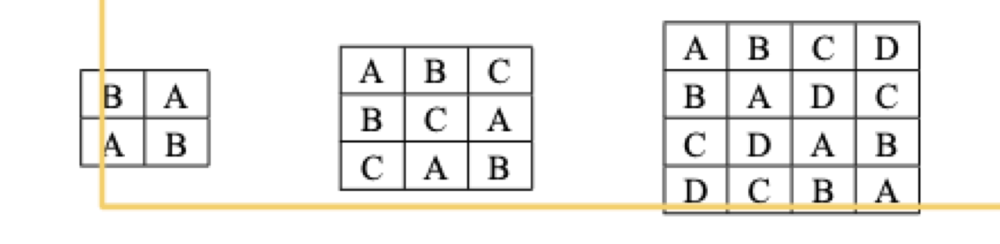

```{r, echo = FALSE}
library(tidyverse)
library(agricolae)
library(visreg)
library(gmodels)
```

# The Latin Square Design (LSD)

Sometimes you will have two sources of variation in space or time, or perhaps space and time.  Perhaps there is a gradient of elevation up and down a hillside, and a gradient of sun incidence orthoganol (90˚) to that.  There are innumerable examples one could imagine.  The principle is that in an LSD, the treatments are allocated randomly in 'rows' and 'columns'.

```{r, echo = FALSE}

```

A Latin Square blocks on both rows and columns simultaneously. 

Agricolae has a built in function for helping generate these designs, obvio.  Again, new section or new script.....

```{r}
# makes sure random allocation happens the same for everyone.
set.seed(123)

#
treat<- c("Cont","Herb1","Herb2","Placebo")

# design.lsd
design <- design.lsd(treat,serie = 0)$book
design
```

Make sure you understand that the double-blocking has happened!  See the figure above with 4 letters.  Can you create on a piece of paper the matrix from this design you've made in R?

Now, lets generate some data, as before.

```{r}
# for fun, set again.
set.seed(123)

Total.units <- length(treat) * length(treat)
error <- rnorm(Total.units,0,1)

# make sure you think about where we generated variation in the blocking!
design$obs <- 20 + 
  (design$treat=="Herb1") * 10 + 
  (design$treat == "Herb2") * 9 + 				
  (design$row==1) * 10 - (design$col==4) * 10 + 
  error

# look at it....  there are three explanatory variables... 
# treat, row-block, column-block!
head(design)
```

### Fitting the model

Let's fit the naive and full models as before

```{r}
naive_lsd <- lm(obs ~ treat, data = design)
full_lsd <- lm(obs ~ row + col + treat, data = design)
anova(naive_lsd)
anova(full_lsd)
```

Very quickly we can see, again, that without blocking, we have a risk of not detecting differences among treatments!

Take a look above at the `design$obs` object.  Can you review the `summary` output and validate that the model is estimating what we simulated?

```{r}
summary(full_lsd)
```

Finally, we can use contrasts to test a few of our key hypotheses.  Make some notes on what these things mean!

```{r}
#first the set of comparisons with control
contrast1 <- rbind(
  "C v H1" = c(-1,1,0,0),
  "C v H2" = c(-1,0,1,0),
  "C v P" = c(-1,0,0,1))

fit.contrast(full_lsd, "treat", contrast1)

# now the H1 vs H2
contrast2 <- rbind("H1 v H2" = c(0,-1,1,0))
fit.contrast(full_lsd, "treat", contrast2)
```

