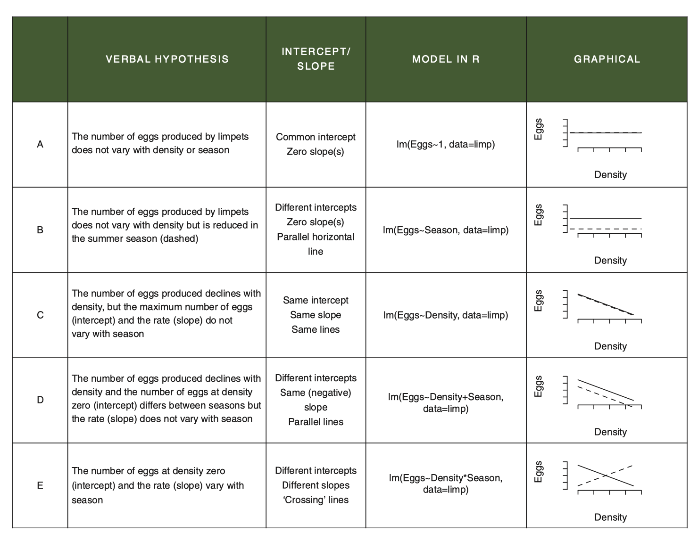

# Introducing the ANCOVA - the analysis of covariance    

```{r, echo = FALSE, warning=FALSE, message=FALSE}
library(tidyverse)
library(ggfortify)
library(agricolae)
library(car)
library(gmodels)
library(visreg)
library(patchwork)
```

In the previous chapters, we introduced classic experimental design principles, and in doing so, we focused on revisiting the 1-way ANOVA and introduced the 2-way ANOVA.  In these models, the explanatory variables are categorical (they are factors).  This means explanatory variable has distinct, discrete categories or _levels_.

In many of our experiments, however, we might combine these categorical variables with a continuous variable.  For example, we might estimate eggs produced as a function of body size and season or we might estimate the effect on plant growth rates of soil moisture in high versus low Nitrogen (N) conditions.

These simple examples describe an ANCOVA, where the one explanatory variable is continuous (e.g. body size or soil moisture) and the other is categorical (e.g. season or N-level).  When this is the case, we are essentially combining the ANOVA with the Regression.  If we recall that regression is largely about estimatinge slopes and intercepts, we might think, hey, COOL, so in an ANCOVA, we can ask if the categorical variable alters the slope or not.....

What's very important to understand is that our core statement about interactions does not change.

> The effect of X on Y varies by Z, translates to a) The effect of body size on egg production varies by season; or b) the effect of soil moisture on growth rate varies by N-level

When written like this, the previous statements about slopes should be even more clear.  The effect of body size (continuous) on egg production is a regression and we estimate a slope.  We then can ask whether this slope is different between seasons.

## Setting up the various ideas.

Let's start by looking at an example where the effect of Height on Weight varies by Sex.  This is a classic set of data from numerous organisms....  it captures biologically the question about sexual dimorphism - does the relationship between Height and Weight (a regression) vary by Sex (ANOVA)?

This relationship can take on many patterns.

```{r, echo = FALSE}
knitr::include_graphics("images/ANCOVA_1.png")
```

- In the upper left we see a pattern where Males are heavier than Females, but there is no effect of Height on Weight.
- In the upper right, we see that there is a positive relationship between Weight and Height, but no differences between Males and Females.
- In the lower left, we might argue that there is a positive relationship between Weight and Height, that the relationship between Weight and Height does not vary (the slope is the same) and that Males are heavier (the red dots are mostly above the blue)
- In the lower right, we see evidence of an interaction - the effect of Height on Weight (the slopes), varies by Sex.

It's quite important to recognise that each of patterns is possible outcome to testing the SAMEa hypothesis. The key thing to remember is that we have an a priori (in advance hypothesis).  Regardless of the pattern, we should specify the appropriate model to test your the hypothesis and answer the question that motivated the design of the experiment and data collection.

For example, in these data, we fundamentally start with the question - does the effect of Height on Weight vary by Sex.  The data might look like any of the above patterns.  But as we started with that, we have to try and answer that question.  And there is only one model syntax in the above figure that does this: `Weight ~ Height * Sex`.  We'll expand on what this means as we work through the example.

## Working through and example.

Let's work with a built in dataset in R - the Davis Study, which is exactly these data.  The associated assignment is another example.

The process of doing this will follow a tried and true approach to analysing data.  You should embed this workflow in your head:

1) PLOT the Data
2) Build the model to test the hypothesis
3) Check the Assumptions
4) Make Inference
5) Update the Figure for Publication

### Get the data and make your picture

The data are built into R, but embedded in the `carData` package, which was installed with the `car` package.

```{r}
Davis <- carData::Davis

glimpse(Davis)

ggplot(Davis, aes(x = height, y = weight, col = sex))+
  geom_point()
```

Ahh.... first hurdle.... what's going on here?  Well, always plot your data is totally justified, because it looks like one of the data points has the Height and Weight data entered incorrectly.

Let's fix that.  Lets find the row, and make the change

```{r}
#which row? 12
Davis %>% filter(height < 100)

# BASE R syntax to see each observation
Davis$weight[12]
Davis$height[12]

# BASE R syntax to change them
Davis$weight[12] <- 57
Davis$height[12] <- 166

# replot
ggplot(Davis, aes(x = height, y = weight, col = sex))+
  geom_point()
```

Excellent.  Lets look at this picture and ask ourselves whether the effect of Height on Weight appears to vary by Sex?  What do you think?

We can actually get a bit of help here.  We can use some ggplot magic to help us make this GUESS. 
> NOTE: this is not doing statistics.  This is using graphics to help guide our expectation of the outcome of doing the statistical test of our hypothesis.

```{r}
ggplot(Davis, aes(x = height, y = weight, col = sex))+
  geom_point()+
  # add a best fit line to each group (the sex category)
  geom_smooth(method = lm, se = FALSE)
```

Again, we have not 'proven' anything or tested our hypothesis.  What we have is a good guess though.  We can guess that 

1. Males are heavier than females (what is the difference in the intercepts?)
2. The effect of height on weight is positive (the slope(s) are positive, not negative)
3. There might be a difference in slopes - the Male line is steeper.

We might even go as far to estimate by eye the slope assuming that there is no effect of Sex.  Recalling that the slope is the rise/run or the change in y over the change in x, we can guess that the slope is ~ (100-40)/(200-140) = (60/60) = 1.  We are not expecting much variation around that.  But if we see the statistics returning a value 10x more or less than this, we should be concerned!

## Building the model (and understanding it)

The next step is to build the model to test our hypothesis.  As we declared above, the model to test the interaction is `lm(weight ~ height * sex, data = Davis)`.  Let's discuss this a bit.

First, this model expands to the following full description:

`lm(weight ~ height + sex + height:sex, data = Davis)`

This reads as "Weight is a function of the effect of Height (slope), Sex (intercept) and the interaction between Height and Sex (do the slopes vary?).  The `Height * Sex` syntax always expands to this _full  model_ - the model containing the main effects and the interaction.

OK.  Let's fit the model

```{r}
# we call the model mod_Davis.
mod_Davis <- lm(weight ~ height + sex + height:sex, data = Davis)
```

That's it.  We've got the model. But before we make any attempts at actually evaluating our test of the hypothesis, we have to check the assumptions!  

To do this, we use the autplot function from the ggfortify package.  

```{r}
autoplot(mod_Davis)
```

OK.  Let's walk through the three core diagnostics.

In the upper left, we are evaluating the systematic part of the model - are there any systematic departures from the linear model we've speficied?  Are there interactions missing or specific nonlinearities?  Nope.

In the upper right, we are evaluating the normality of the residuals.  These too look pretty good.

In the lower left, we are evalauting the assumption of a constant mean-variance relationship.  Oops.

### Dealing with some issues with residuals.

The above issue is one we can deal with via a _transformation_.  Let's start with the facts....  When the variance increases with the mean, one transformation that can work is the logarithm of the continuous variables.

ADD DYLANS STUFF FROM MEE PAPERS and Mean - VARIANCE

```{r}
# re-plot with log-log
ggplot(data = Davis, aes(x = log(height), y = log(weight), col = sex))+
  geom_point()+
  geom_smooth(method = lm, se = FALSE)

# fit the model - note we can specify the transformation RIGHT IN THE MODEL
mod_Davis_log <- lm(log(weight) ~ log(height) * sex, data = Davis)

# check the new residuals
autoplot(mod_Davis_log)
```

This is definitely flatter - you can tell by the range on the y-axis of the scale-location plot.

So, we can now move to evaluating the model.  You are probably thinking about what it means to analyse the data on the log-log axis.... we will come to that shortly.

### Making inference on the ANCOVA

OK.  So, the next step is to use review the ANOVA table - yes, we use the same Anova function to build an anova table to explore the results of an ANCOVA.

Let's revisit our initial guesses and work through what the model is telling us:

1. Males are heavier than females (what is the difference in the intercepts?)
2. The effect of height on weight is positive (the slope(s) are positive, not negative)
3. There might be a difference in slopes - the Male line is steeper.
`

```{r}
anova(mod_Davis_log)
```

The table tells us that there is no evidence for an interaction.  The last line of this table contains the p-value for the interaction.  It is testing the null hypothesis that the slopes are the same.  We can not reject this null hypothesis.  There is no evidence that allowing the slopes for Males and Females be different is supported.  That's the answer to guess 3 above. It is also the answer to our question: does the effect of Height on Weight vary by Sex.  Nope.

However, we do detect _main effects_ of height and sex.  This means that each of these DOES have an effect - but we say the effects are additive.

Great.  What this means is that the data actually conform to picture in the lower left.

```{r, echo = FALSE}
knitr::include_graphics("images/ANCOVA_1.png")
```

There is a slope associated with Height (we don't know whether it's positive or not, but we think it is), and there is an effect of sex (we don't know whether Males are heavier yet).  What we can say, with confidence, is this.

> The effect of height on weight did not vary by sex (F = 1.01, df = 1,196, p = 0.29).  The effect of sex (F, df, p) and height (F, df, p) are thus additive on Weight.

Another way to read this is the following:

When we allow for a common slope associated with logHeight, we capture 4.66 units of variation in weight, which when compared to the 0.013 units of variation left over (residual MSE), is alot.  The F is thus BIG and the p-value small.  When we allow for an effect of Sex to define different average weights, this too is important as it captures 0.344 units of variation in weight, which comparied to the 0.013 units in the residual, is also big (Big F, small P).  However, when we allow for the slopes caused by height to vary with sex, this captures very little variation with respect to the residual variation (0.014 comprared to 0.013) hence a small F and a large P.

###  The summary table and making sense of the log stuff.

Let's start investigating the actual details via the `summary` table:

```{r}
summary(mod_Davis_log)
```

This table reports on the _treatment contrasts_ we introduced earlier this semester.  Let's walk through the details.

The first two rows correspond to one of the sexes.  Can you identify which one?  The hint is looking at the other rows.  They have an M after them.  M comes after F.  So the first two rows correspond to the intercept and slope of the Females.

You may be asking why the intercept is a negative number.  A simple look back at the range of the x-axis should answer this... the y intercept occurs at x = 0, right?

You should understand, from the principles of an equation for a line, the following:

> the effect of height on weight for females is `log(weightF) = -5.31 + 1.82*log(heightF)`.

OK... let's interpret what the next two lines mean.  The third line is labelled `SexM.` The fourth is labelled `logHeight:SexM`.  Any guesses as to which is associated with the slope and which the intercept?

One trick, again, is to recognise the syntax -> the presence of the `:` is indicative of the interaction which is the thing that lets slopes vary.  So, `SexM` is about intercepts and `logHeight:SexM` is about slopes.  But what are they?

Please recall from previous work that treatment contrasts are about DIFFERENCES.  Thus, the `sexM` term is a difference between the female and make intercept and the `logHeight:SexM` is about the difference between the female and make slopes. 

This allows the following maths....

`log(weightF) = -5.31 + 1.82*log(heightF)`

`log(weightM) = (-5.31-2.37) + (1.82+0.48)*(log(heightF))`

However, we know that the 0.48 increase in the slope is not siginficant, and as a result, the -2.37 increase in the intercept is also not correct.

###  The equations supported by the model.

In order to identify the equations supported by the model, we can refit the model to reflect the ADDITIVE effects only.

```{r}
mod_Davis_log2 <- lm(log(weight) ~ log(height) + sex, data = Davis)
summary(mod_Davis_log2)
```

Right, now we get our expected pattern:

`log(weightF) = -6.46 + 2.05*log(heightF)`

`log(weightM) = (-6.46 + 0.12) + 2.05*log(heightF)`

We can see the common slope and the slightly higher average weight (0.12 units!) of males.

### Making even more inference and drawing the picture

OK, lets use some plotting tricks and get a nice picture:

```{r}

# first create a data frame to use that combines the raw data 
# with the predictions from the model
# note that the model is the ADDITIVE model, for plotting
plotThis <- Davis %>% 
  mutate(preds = predict(mod_Davis_log2))

# now, make lines with the model predictions
# and add the points as the raw data
# pay attention to where we are using log()!
ggplot(plotThis, aes(x = log(height), y = preds, col = sex))+
  geom_line()+
  geom_point(aes(y = log(weight)))
```

Great.  Now we can see that the full model (mod_Davis_log) told us.  The lines are parallel.  There is no interaction.

In fact, we can do a bit more here.

Remember that the model says

For women log(weight)= -6.46 + 2.05 * log(height)
For men   log(weight)= (-6.46 + 0.12) + 2.05 * log(height)

Because we are in log land, we can do some clever maths: We know that 

`log(weight Female) - log(weight Male) = - 0.12`

(this is the treatment contrast for the intercept).  We also know (please memorise) that the difference between logs is equal to the log of the ratio:

`log(weightF/weightM) = -0.12`

Finally, we can convert both sides to non-log by exponentiating:

`exp(log(weightF/weightM)) = exp(-0.12) = 0.88`

What does this mean?  At any given height, female weight is 88% of a makes (12% lower).

Cool!  That's one of the benefits of log-log linear relationships.  The ratio of the categories in log-log land directly translates to a percent difference between the groups.

It's also worth noting that the height slope is ~2, which suggests... yes... because we are in log-land, that weight scales with $height^2$.

One way to 'test' this is to ask whether estimating the log(weight) slope improve the fit of the model compared to fixing it at 2.  Here are ways: 'by hand' and by a function in the `car` package.

```{r}
# by hand
# we use the offset function to fix the slope of height at 2
mod_Davis_offset <-lm(log(weight) ~  sex + offset(2*log(height)), data=Davis)

# then compare it to the model where we estimate it freely.
anova(mod_Davis_log2, mod_Davis_offset)

# by car package
car::linearHypothesis(mod_Davis_log2, "log(height) = 2") # the estimate IS 2
car::linearHypothesis(mod_Davis_log2, "log(height) = 0") # the estimate IS NOT 0.
```


## Some General Principles

###  ANCOVA always tests the interaction against the additive model

This figure highlights the various models and interpretations associated with the pieces of an ANCOVA dataset.  This is a way to envision all of the potential linear relationships among the variables that might arise in an experiment with a continuous and categorical explanatory variable.

Note that just because your data looks like a particular pattern doesn't mean you should use that model.  Your statistical model should be driven by your question and original design.

```{r, echo = FALSE, fig.cap = "From Getting Started with R, 2nd Edition, OUP"}

```

For example, if you design a study with an ANCOVA question in mind, you are always starting your analysis with the question of whether the effect of X on Y varies by Z.  Thus, ANCOVA always starts with comparing the interaction (model E) against the additive model (model D).

>Proof: If we compare the additive model and the model with the interaction, we are specifically testing for whether allowing the slopes to vary by sex _explains additional variation_ above and beyond the main, additive effects of height and sex.  To do this, we use `anova()` but pass it two models.  This does what is called a Liklihood Ratio Test.
Compare the result of the first test to the last line of the second.  This proves that when we fit model E, the test for the interaction is a comparison with model D!

```{r}
anova(mod_Davis_log, mod_Davis_log2)
Anova(mod_Davis_log)
```

### Specifying models in R

We can add terms
`weight ~ sex + height`

Have crossed terms
`weight ~ sex * height` which is `weight ~ sex +  height + sex : height`

Remove terms
`weight ~ sex * height – sex : height` which is `weight~ sex +  height`

Include all interactions up to order k
`weight~ (sex + height + age)^2` which is `sex + height + age + sex : height + sex : age + age : height`