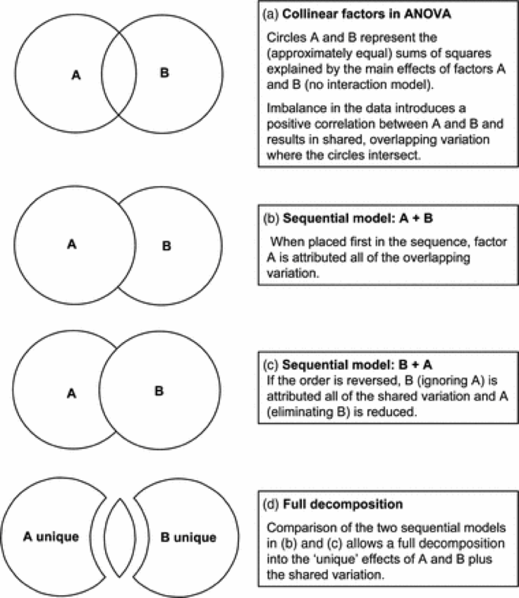

# Nonlinearities, polynomials and regression

```{r, echo = FALSE, warning=FALSE, message=FALSE}
library(tidyverse)
library(ggfortify)
library(agricolae)
library(car)
library(gmodels)
library(visreg)
library(patchwork)
```

If you recall from chapter 1, we introduced the general linear model, and finished with an example where the data were highly non-linear and based on the following equation

$y = 0.01 + x^{2} + \epsilon$

```{r, echo = FALSE}
# set x range
x <- -100:100
# define y without error
y_det <- 0.01*x^2
# add some random variation
y <- y_det+rnorm(length(x),0,10)

# create dataframe and plot
df <- data.frame(x, y)
ggplot(df, aes(x = x, y = y))+
  geom_point()
```

In this final section of the module, we are going to analyse a nonlinear relationship using a linear model.  This exercise should accomplish two tasks.  First, it will show you how to build models to capture non-linearity.  Second, it will reinforce how we use the diagnostic tools to critique our model before moving on to make inference.

##  Transformations - a reminder and starting point.

Transformations, as we discussed in previous chapters, allow lots of models to be expressed as a linear model.

For example the model for exponential growth (Numbers vs Time)

$N_{t}=N_{0}*e^{(r*t)}$

Remembering some rules of logrithms, this can be expressed as a linear model as:

$log(N_{t})=log(N_{0}) + r*t$

Here, $log(N_{0})$ is the y-intercept and $r$ is the gradient or slope, and $t$ = time is the x-axis explanatory variable and $log(N)$ is the y-axis response variable.

## Working through an example.

Don't forget that you need the `tidyverse`, `car` and `ggfortify` packages (use `library()`) to make all of this work!

We are going to work with a built in dataset about cars to demonstrate how to detect and model non-linearities.  This is an exercise in multiple regression and in using the diagnostic plots.

The data are built into R and we don't need to do anything but remember that the dataset is called cars.  Lets see what it looks like.  The `speed` is how fast the car is going before it is 'asked' to stop, and the `dist` variable is how long it takes to stop in m

```{r}
glimpse(cars)
```

Let's start with step 1: making a good picture.

```{r}
ggplot(cars, aes(x = speed, y = dist))+
  geom_point()+
  ylab("Speed (km/hour")+xlab("Stopping Distance (m)")
```

There are a three things we should immediately notice in this figure.  The first is that there is a positive relationship.  The second is that it appears to be a bit non-linear, even _exponential_.  Third, it looks like there is more variation out at high speeds than at low speeds.

Let's ignore all of this for the moment and fit the model and acquire the diagnostics.  

```{r}
mod_dist <- lm(dist ~ speed, data = cars)
autoplot(mod_dist)
```

OK - our preliminary assessment about non-linearity and non-constant variance appears to be spot on!  There are systematic departures from the linear model indicated by the upper left plot.  

Here we add a line to the data (plot) to understand why the residuals in the upper-left panel is u-shaped.  Make sure you get the idea that the majority of the **data** are _above_ then _below_ then _above_ the line as you move across the graph.  This generates residuals that have the pattern we see!

```{r, echo = FALSE, message=FALSE}
ggplot(cars, aes(x = speed, y = dist))+
  geom_point()+
  geom_smooth(method = lm, se = FALSE)+
  ylab("Speed (km/hour")+xlab("Stopping Distance (m)")
```

The lower left panel of the residuals/diagnostics indicates that the variance does increase with the mean.

### Interlude 1 - Inference before fixing the problem

I want to have us look at this model now before moving on.  If we ignore the residuals, we end up with a strong conclusion that there is a positive linear relationship between stopping distance and speed.

```{r}
anova(mod_dist)
summary(mod_dist)
```

### Solving the Problem I: The Non-linearity

In order to fix this problem, we can take note from our first example in chapter 1 and fit a multiple regression model with a polynomial!

```{r}
mod_dist_nonLin <- lm(dist ~ speed + I(speed^2), data = cars)
autoplot(mod_dist_nonLin)
```

Wow.  That's a massive improvement on the diagnostic that indicated a systematic departure from the linear relationship between dist and speed.  But.... we still have non-constant variance - the variation in predicted distance is still increasing with the mean.

### Interlude 2 - Inference before fixing both problems

As above, lets look at what the model tells us:

```{r}
anova(mod_dist_nonLin)
summary(mod_dist_nonLin)
```

Hmm.  That's interesting.  We've added a term to the model to capture that hint of the non-linearity.  There are two ways we might think this is 'unjustified'.  First, there is no evidence that this new term is significant.  Second, we can formally compare the two models, giving us a p-value that's familiar from the tables above.

```{r}
anova(mod_dist_nonLin, mod_dist)
```

One might stop here and return to the data and the diagnostics and thing, hmmm... that systematic departure issue?  Not really a big deal after all.... but lets carry on.

### Solving the Problem II: Non-constant - increasing variance 

One of the ways to 'fix' this problem, is to make an assumption that the variance is proportional to the mean.

In the absence of this, the relationship is $\sigma^{2} * speed$  - as speed increases, the variance increases.  But if we assume that the variance is proportional, we get $1/speed * \sigma^{2} * speed$.....

To do this in the model, we can use the _weights_ argument:

```{r}
mod_dist_nonLin_weight <- lm(dist ~ speed +I(speed^2), weights = 1/speed, data = cars)
autoplot(mod_dist_nonLin_weight)
```

Super.  We now have a model where we capture the non-linearity using a polynomial and capture the issue of increasing variance by making the model reflect our assumption that different observations have different variances.

### Interlude 3 - Inference with both things corrected.

OK.  Now we are ready for using the anova table and summary table to make inference and update our figure.

#### Anova Tables with multiple explantory variables.

In previous exercises, we've used `anova()` to generate the anova table, F-statistics and p-values to test our hypotheses.  It's very important to note that `anova()` makes a sequential sums of square calculation.

In our ANCOVA example, the model we fit was `lm(log(weight) ~ log(height) * sex, data = Davis)`.  We know this expanded to `log(height) + sex + log(height):sex`.  

When we reviewed the Anova Table, there were four rows corresponding to each of these three terms (2 main effects and 1 interaction) and the residual (remaining) variation.

In this table produced by `anova()`, we read it like this.  First, we ask how much variation is explained by log(height).  Having explained this variation, and left some unexplained, how much is then explained by sex.  Finally, having explained some variation by log(height) and some of the remaining then by sex, can we explain any more by allowing slopes to vary (the interaction).

The key thing to note here is that this was a sequence.  Sometimes this is fine - all we are interested in is the last line, for example, testing the hypothesis that the effect of height on weight varied by sex.  This makes sense when we've designed an experiment to test a hypothesis.

However, in multiple regression, like our example with speed and distance, we need to worry about the order.  It's really important too worry about this when we've NOT done a manipulative and designed experiment.  This is because the terms in the model can be collinear.  In an experiment, treatments are always independent.  In observations studies, or when we start making polynomials, variables become non-independent.

Collinearity occurs when:

-One of the predictor variables is a function of another as in speed and speed^2
-Your design is unbalanced, generating a non-orthogonal design – note not all unbalanced designs are non-orthogonal.

How do we avoid using the sequence?  Well, let's introduce the trick, and then reveal how it's working.

The trick is `Anova()` - not the big A.  We call it **Big-A Anova**.  It's in the `car` package.

```{r}
Anova(mod_dist_nonLin_weight)
```

#### Explaining the Trick

So, this table is actually constructed by fitting two different models.  One of those models is where $speed$ is first and $speed^{2}$ is second.  The other model is where $speed^{2}$ is first and $speed$ is second.

```{r}
anova(lm(dist ~ speed +I(speed^2), weights = 1/speed, data = cars))
anova(lm(dist ~ I(speed^2)+speed, weights = 1/speed, data = cars))
```

Pay close attention.... can you see which of the $speed$ and $speed^{2}$ F and p-values from EACH of the two models are combined in the Big-A Anova table?  It's from when the are _last in the model_.

Technically, this is called a Type II anova table.  Technically, it means that we are estimating the effects of each term, controlling for the other and respecting 'marginality'.  The Big-A Anova takes care of this _'rotation of the position of the terms'_ for us and produces the accurate test table we need.

For unbalanced data Type II ANOVA is recommended.  In many cases the biology can be used to settle the question. Say for example if you’re interested in the effect of a flower type on pollination after correcting for the effects of plant size - you know plant size affects the number of pollinator visits. Or if you have blocks (what are they?) then you might be interested in treatment affects after correcting for the effect of block.

This diagram may be valuable in helping you understand this idea.

```{r, echo = FALSE}

```

### Explaining the result.

So, hopefully that makes sense.  We'll review more of that in the generalised linear model module with Dylan Childs.

What you might be wondering, however, is what the result means.  We have no p-values that are < 0.05.  Controlling for speed, there is no effect of speed^2 and vice-versa.  We kind of new that from our initial 'sequential' assessment above.... 

OK.  Whoa.  This is weird, right?

## A dose of reality

Let's plot all of these three models we've made together with the data

```{r, echo = FALSE}
plotCars <- cars %>% 
  mutate(preds_lin  = predict(mod_dist),
         preds_nonLin = predict(mod_dist_nonLin),
         preds_nonLin_w = predict(mod_dist_nonLin_weight)) %>% 
  pivot_longer(-c(dist, speed), names_to = "model", values_to = "preds")

ggplot(plotCars, aes(x = speed, y = preds, colour = model))+
  geom_line()+
  geom_point(aes(y = dist))

```

At this point, we should ask, is the non-linear model makeing sense?  We think it probably should, right?  It's what the data look like and there was a hint of it in the residuals.  But in the end, there is no evidence for a relationship.

Perhaps there is a better way to go about this.  And in this better way a lesson in p-values and statistics.

> Nothing beats a good question and an understanding of the mechanism you are actually evlauating.

## A mechanistic model

Here we have a mechanistic model stopping distance in made of:

- Thinking distance – distance travelled while driver reacts so this is reaction time * speed
- Braking distance – which depends on the car’s kinetic energy which is proportional to speed^2


So we expect a model of the form – note that there is NO intercept

$Distance = \beta_{1}*Speed + \beta_{2}*speed^{2}$

We can fit this model really simply with that trick of -1 .... and all of a sudden....

```{r}

# fit model without intercept
mechMod <- lm(dist ~ speed +I(speed^2) - 1, weights = 1/speed, data = cars)

# all the inferences
anova(mechMod)
Anova(mechMod)
summary(mechMod)

# plotting
plotMech <- cars %>% 
  mutate(preds = predict(mechMod))

ggplot(plotMech, aes(x = speed, y = dist))+
  geom_point()+
  geom_line(aes(y = preds))
```

## The Take Home Messages

This example is not out of the ordinary of what you might face with your own data.  The recipe for success in data analysis is a but different from what you might expect.

1. Design experiments to test hypotheses with Randomisation, Replication and Reducing Error in mind.
2. Think about your question and the mechanisms expected to give rise to the pattern
3. Plot your data and look at the patterns.
4. Fit appropriate models.  Models for experiments are easier to define than models from survey and observation.  Models for experiments don't have to worry as much about collinearity....
5. Don't follow the p-value.
6. Eat Biscuits


